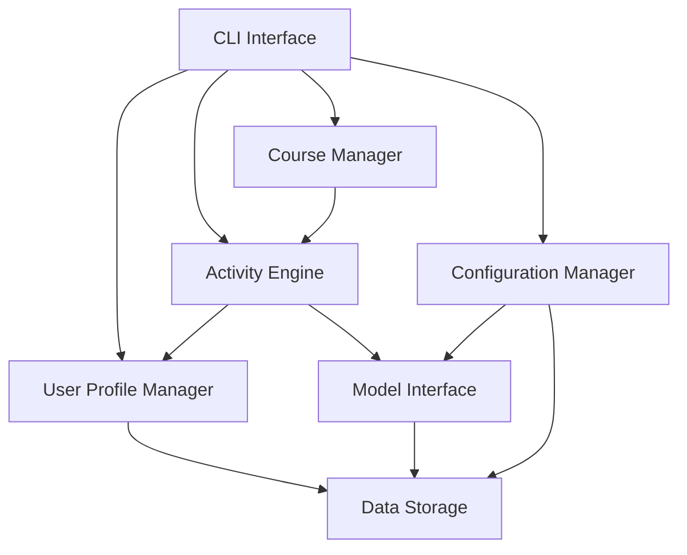

# Langue - Implementation Plan

## 1. System Architecture

### 1.1 Core Components
- **CLI Interface**: Main entry point and user interaction handler
- **Activity Engine**: Manages different learning activities
- **Course Manager**: Organizes activities into structured courses
- **Model Interface**: Handles communication with various AI models (local and cloud-based)
- **User Profile Manager**: Tracks progress, scores, and preferences
- **Data Storage**: Handles persistence of user data and language content
- **Configuration Manager**: Manages user settings and model configurations

### 1.2 Component Relationships


## 2. Technical Stack

### 2.1 Core Technologies
- **Language**: Python 3.10+
- **AI Models**:
  - Claude Haiku 3.5 via Anthropic API
  - Local models via Ollama
  - OpenAI models (optional)
  - Other LLM APIs (optional)
- **CLI Framework**: Click or Typer for command-line interface
- **Data Storage**: SQLite for local storage
- **Terminal UI**: Rich or Textual for enhanced terminal display

### 2.2 Dependencies
- **anthropic**: Official Anthropic API client
- **ollama**: Interface for local Ollama models
- **openai**: OpenAI API client (optional)
- **click/typer**: CLI framework
- **rich/textual**: Terminal UI enhancements
- **sqlite3**: Database interactions
- **pydantic**: Data validation and settings management
- **pytest**: Testing framework
- **python-dotenv**: Environment variable management
- **requests**: HTTP client for API interactions
- **toml/yaml**: Configuration file management

## 3. Development Phases

### Phase 1: Foundation (Weeks 1-2)
- Set up project structure and development environment
- Implement basic CLI interface with language selection
- Create initial user profile management
- Establish model interface architecture with:
  - Ollama integration for local models
  - Claude Haiku integration for cloud-based models
- Create configuration system with model selection
- Build simple flashcard activity
- Implement basic progress tracking

### Phase 2: Core Features (Weeks 3-4)
- Add fill-in-the-blank activity
- Implement basic chat functionality
- Create persistent storage for user data
- Develop scoring and streak tracking
- Build activity selection menu
- Add initial error handling and logging
- Implement model discovery for Ollama

### Phase 3: Expansion (Weeks 5-6)
- Implement additional learning activities
- Create course structure functionality
- Enhance chat with difficulty levels
- Improve progress visualization
- Add achievement system
- Implement comprehensive error handling

### Phase 4: Refinement (Weeks 7-8)
- Performance optimization
- User experience improvements
- Comprehensive testing
- Documentation completion
- Final bug fixes

## 4. Directory Structure

```
langue/
├── README.md
├── requirements.txt
├── setup.py
├── .env.example
├── .gitignore
├── langue/
│   ├── __init__.py
│   ├── main.py             # Entry point
│   ├── cli/                # CLI interface
│   │   ├── __init__.py
│   │   └── commands.py
│   ├── activities/         # Learning activities
│   │   ├── __init__.py
│   │   ├── base.py
│   │   ├── flashcards.py
│   │   ├── fill_blank.py
│   │   └── chat.py
│   ├── courses/            # Course management
│   │   ├── __init__.py
│   │   └── manager.py
│   ├── models/             # Model interfaces
│   │   ├── __init__.py
│   │   ├── base.py         # Abstract model interface
│   │   ├── claude.py       # Claude Haiku integration
│   │   ├── ollama.py       # Ollama integration
│   │   ├── openai.py       # OpenAI integration (optional)
│   │   └── discovery.py    # Model discovery utilities
│   ├── config/             # Configuration management
│   │   ├── __init__.py
│   │   ├── settings.py
│   │   └── manager.py
│   ├── user/               # User profile management
│   │   ├── __init__.py
│   │   ├── profile.py
│   │   └── progress.py
│   ├── storage/            # Data persistence
│   │   ├── __init__.py
│   │   └── database.py
│   └── utils/              # Utility functions
│       ├── __init__.py
│       └── helpers.py
```
├── tests/                  # Test suite
│   ├── __init__.py
│   ├── test_activities.py
│   ├── test_courses.py
│   └── test_user.py
└── data/                   # Local data storage
    └── .gitkeep
```

## 5. Implementation Details

### 5.1 User Data Model

```python
class UserProfile:
    id: str
    username: str
    languages: List[str]
    current_language: str
    word_count: Dict[str, int]  # language -> count
    points: int
    streak_days: int
    last_active: datetime
    achievements: List[str]
```

### 5.2 Activity Interface

```python
class Activity(ABC):
    @abstractmethod
    def start(self) -> None:
        pass
        
    @abstractmethod
    def get_instructions(self) -> str:
        pass
    
    @abstractmethod
    def process_input(self, user_input: str) -> Tuple[bool, str, int]:
        # Returns: (success, feedback, points)
        pass
```

### 5.3 Model Interface Architecture

#### Base Model Interface
```python
class ModelInterface(ABC):
    @abstractmethod
    def get_response(self, prompt: str, system_prompt: str, **kwargs) -> str:
        pass
    
    @abstractmethod
    def get_supported_languages(self) -> List[str]:
        pass
        
    @property
    @abstractmethod
    def is_online(self) -> bool:
        pass
```

#### Claude Haiku Integration
- Use Claude's system prompt to define its role as a language teacher
- Create prompt templates for different activities
- Implement token usage tracking for cost management
- Establish error handling for API failures
- Cache common responses for efficiency

#### Ollama Integration
- Discover available models on the local system
- Create interface for communicating with local Ollama server
- Implement model capability detection
- Provide offline functionality with local models
- Cache responses for improved performance

#### Model Selection Logic
- Prioritize user's preferred model
- Fallback logic for offline scenarios
- Model capability matching for specific activities

### 5.4 Configuration Management

- Store user preferences in TOML or YAML format
- Provide CLI commands to view and edit configuration
- Include settings for:
  - Preferred language models
  - API keys and endpoints
  - Ollama server location
  - UI preferences
  - Language learning preferences
- Support automatic model discovery with Ollama
- Implement configuration validation

### 5.5 Progress Tracking Mechanism

- Store word exposures with timestamps
- Calculate streak based on daily activity
- Award points for different actions:
  - Activity completion: 10 points
  - Correct answers: 5 points
  - New words encountered: 2 points
  - Daily login: 20 points

### 5.6 Offline Capability

- Ensure core functionality works without internet connection
- Implement local caching of frequently used content
- Provide graceful degradation when preferred online models are unavailable
- Support seamless switching between online and offline modes
- Store model responses for reuse in similar contexts

## 6. Testing Strategy

### 6.1 Unit Tests
- Test individual components in isolation
- Mock Claude API responses
- Validate core functionality

### 6.2 Integration Tests
- Test component interactions
- Validate end-to-end workflows
- Test database operations

### 6.3 User Testing
- Gather feedback on usability
- Test with different experience levels
- Validate learning effectiveness

## 7. Deployment and Distribution

### 7.1 Packaging
- Create PyPI package for easy installation
- Package as standalone executable with PyInstaller

### 7.2 Installation
- Simple pip installation: `pip install langue`
- Documentation for API key setup

### 7.3 Updates
- Version management strategy
- Update notification system

## 8. Risk Management

### 8.1 Potential Challenges
- API rate limits or costs for cloud models
- Handling network interruptions
- Ensuring accurate language learning content
- Terminal limitations for complex UI
- Varying capabilities between different models
- Resource constraints on lower-powered devices
- Ollama installation requirements

### 8.2 Mitigation Strategies
- Implement caching to reduce API calls
- Build robust offline capabilities with Ollama
- Add content validation steps
- Focus on simplicity and clarity in UI design
- Create abstraction layers to normalize model outputs
- Optimize for lower resource usage when using local models
- Provide clear installation instructions for dependencies
- Implement model capability detection and appropriate fallbacks

## 9. Milestones and Deliverables

### Milestone 1: Functional Prototype (Week 2)
- Basic CLI interface
- Language selection
- Simple flashcard activity
- Model integration architecture
- Ollama and Claude integration
- Configuration system

### Milestone 2: MVP Release (Week 4)
- Multiple activity types
- User progress tracking
- Basic chat functionality
- Data persistence

### Milestone 3: Feature Complete (Week 6)
- All planned activities
- Course system
- Advanced chat options
- Achievement system
- Complete offline capability
- Multi-model support

### Milestone 4: Production Ready (Week 8)
- Optimized performance
- Complete documentation
- Packaged for distribution
- All tests passing
- Model discovery system
- Comprehensive configuration options

## 10. Future Enhancements

- Speech synthesis integration
- Speech recognition
- Community-contributed content
- Spaced repetition algorithm refinement
- Mobile companion application
- Learning analytics dashboard