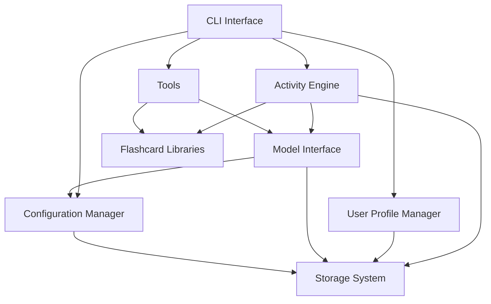

# Langue Technical Architecture

## Overview

Langue is a command-line language learning application built with a modular architecture that separates concerns into distinct components. This document provides a detailed technical overview of the application's architecture, data flow, and key design decisions.

## System Architecture

### Core Components

1. **CLI Interface** (`langue/cli/`)
   - Provides the command-line interface using Click
   - Handles user input and command routing
   - Renders rich text output using the Rich library

2. **Activity Engine** (`langue/activities/`)
   - Manages different language learning activities
   - Provides a common interface for all activities
   - Handles activity lifecycle and state management
   - Includes specialized modules for each activity type
   - Features a modular flashcard system with vocabulary libraries

3. **Model Interface** (`langue/models/`)
   - Abstracts interactions with AI language models
   - Provides adapters for different model backends (Ollama, Claude, etc.)
   - Handles prompt engineering and response processing
   - Includes model discovery and interactive selection
   - Supports configuration via environment variables and .env files

4. **User Profile Manager** (`langue/user/`)
   - Manages user data and preferences
   - Tracks learning progress and statistics
   - Handles streak and achievement systems

5. **Storage System** (`langue/storage/`)
   - Provides data persistence through SQLite
   - Manages database schema and migrations
   - Handles data access and transaction management

6. **Configuration Manager** (`langue/config/`)
   - Manages application settings
   - Loads and saves configuration from TOML files
   - Provides access to environment variables and secrets

7. **Utility Functions** (`langue/utils/`)
   - Provides common helper functions
   - Implements shared functionality used across components
   - Loads environment variables from .env files

### Component Relationships



## Data Flow

### Application Startup

1. User invokes `langue` command
2. Main module initializes the application
3. Configuration is loaded from disk and environment variables
4. Available models are discovered and verified
5. User is prompted to select a model if needed
6. Database connection is established
7. User profile is loaded or created
8. Language proficiency level is determined from user settings
9. Main menu is displayed

### Activity Execution Flow

1. User selects an activity
2. Activity is initialized with current settings and configured model
3. Activity generates content using the selected AI model
4. Content is presented to the user
5. User provides input/response
6. Input is processed and feedback is generated
7. Results are saved to the database
8. User profile is updated with progress

### Model Interaction Flow

1. Activity prepares prompt for model
2. ModelInterface uses the configured model or selects an appropriate fallback
3. Model availability is verified before sending the request
4. Request is sent to model (local or cloud)
5. Response is received and processed
6. Structured data is extracted and returned to activity

## Database Schema

### Core Tables

#### `users`
- `user_id` (TEXT): Primary key
- `username` (TEXT): Display name
- `current_language` (TEXT): Currently selected language
- `points` (INTEGER): Total points earned
- `streak_days` (INTEGER): Current streak count
- `last_active` (TEXT): ISO timestamp of last activity
- `created_at` (TEXT): ISO timestamp of account creation
- `metadata` (TEXT): JSON string with additional data

#### `languages`
- `id` (INTEGER): Primary key
- `user_id` (TEXT): Foreign key to users
- `language` (TEXT): Language name
- `word_count` (INTEGER): Number of words learned
- UNIQUE constraint on (user_id, language)

### `words`
- `id` (INTEGER): Primary key
- `user_id` (TEXT): Foreign key to users
- `language` (TEXT): Language of the word
- `word` (TEXT): The word itself
- `first_seen` (TEXT): ISO timestamp of first encounter
- `last_seen` (TEXT): ISO timestamp of last encounter
- `exposures` (INTEGER): Number of times encountered
- `level` (TEXT): CEFR level (a1, a2, b1, b2, c1, c2)
- UNIQUE constraint on (user_id, language, word)

#### `activities`
- `id` (INTEGER): Primary key
- `user_id` (TEXT): Foreign key to users
- `activity_type` (TEXT): Type of activity
- `language` (TEXT): Language used
- `points_earned` (INTEGER): Points earned
- `words_count` (INTEGER): Words encountered
- `duration_seconds` (INTEGER): Duration of activity
- `completed_at` (TEXT): ISO timestamp of completion
- `metadata` (TEXT): JSON string with activity-specific data

#### `achievements`
- `id` (INTEGER): Primary key
- `user_id` (TEXT): Foreign key to users
- `achievement` (TEXT): Achievement name
- `earned_at` (TEXT): ISO timestamp when earned
- UNIQUE constraint on (user_id, achievement)

## Activity Framework

Activities in Langue follow a common interface defined in the `Activity` base class:

```python
class Activity(abc.ABC):
    """Abstract base class for language learning activities."""
    
    @property
    @abc.abstractmethod
    def name(self) -> str:
        """Get the name of the activity."""
        pass
        
    @property
    @abc.abstractmethod
    def description(self) -> str:
        """Get the description of the activity."""
        pass
        
    @abc.abstractmethod
    def get_instructions(self) -> str:
        """Get instructions for the activity."""
        pass
        
    @abc.abstractmethod
    def generate_content(self) -> Dict[str, Any]:
        """Generate content for the activity using libraries or AI model."""
        pass
        
    @abc.abstractmethod
    def present_challenge(self, content: Dict[str, Any]) -> None:
        """Present a challenge to the user."""
        pass
        
    @abc.abstractmethod
    def process_response(self, user_input: str, content: Dict[str, Any]) -> Tuple[bool, str]:
        """Process the user's response."""
        pass
        
    def start(self) -> None:
        """Start the activity (template method)."""
        # Default implementation manages the activity lifecycle
```

## Model Interface Framework

The model interface provides a common abstraction for different AI backends:

```python
class ModelInterface(abc.ABC):
    """Abstract base class for model interfaces."""
    
    @abc.abstractmethod
    def get_response(self, prompt: str, system_prompt: Optional[str] = None,
                     temperature: Optional[float] = None, max_tokens: Optional[int] = None,
                     **kwargs) -> str:
        """Get a response from the model."""
        pass
        
    @abc.abstractmethod
    def get_supported_languages(self) -> List[str]:
        """Get languages supported by this model."""
        pass
        
    @property
    @abc.abstractmethod
    def is_online(self) -> bool:
        """Check if model requires internet access."""
        pass
        
    @property
    @abc.abstractmethod
    def name(self) -> str:
        """Get the model's name."""
        pass
        
    @abc.abstractmethod
    def check_availability(self) -> bool:
        """Check if the model is available."""
        pass
```

## Flashcard Library Framework

The flashcard library system provides structured vocabulary organized by language proficiency level:

```python
class FlashcardLibraryManager:
    """Manages flashcard vocabulary libraries."""
    
    def get_available_languages(self) -> List[str]:
        """Return list of available language libraries."""
        pass
        
    def get_available_levels(self, language: str) -> List[str]:
        """Return list of available levels for a language."""
        pass
        
    def load_library(self, language: str, level: str) -> Dict[str, Any]:
        """Load a specific vocabulary library."""
        pass
        
    def get_random_word(self, language: str, level: str) -> Dict[str, Any]:
        """Get a random word from the library."""
        pass
        
    def get_words_by_category(self, language: str, level: str, category: str) -> List[Dict[str, Any]]:
        """Get words filtered by category."""
        pass
        
    def get_words_across_levels(self, language: str, levels: List[str]) -> List[Dict[str, Any]]:
        """Get words from multiple levels."""
        pass
```

## Key Design Patterns

1. **Template Method Pattern**: Used in the Activity base class to define the skeleton of the activity flow while letting subclasses override specific steps.

2. **Strategy Pattern**: Used in the Model Interface to allow different model backends to be used interchangeably.

3. **Repository Pattern**: Used in the Storage System to abstract data access logic.

4. **Facade Pattern**: Used in the CLI interface to provide a simplified interface to the complex subsystems.

5. **Command Pattern**: Used in the CLI commands structure to encapsulate requests as objects.

6. **Factory Pattern**: Used in the Flashcard Library system to create word instances from different sources.

7. **Adapter Pattern**: Used to adapt library-based and model-generated content to a common interface.

## Initialization and Configuration

Langue uses a multi-stage initialization process:

1. **Environment Detection**: Identifies operating system and environment variables
2. **Environment Variables**: Loads variables from .env file if present
3. **Configuration Loading**: Loads settings from `~/.config/langue/config.toml`
4. **Model Discovery**: Detects available models (Ollama, API keys)
5. **Model Selection**: Prompts user to select a model if needed
6. **Database Initialization**: Sets up SQLite database if not present
7. **User Profile Loading**: Loads or creates user profile

Configuration follows this precedence order:
1. Command-line arguments
2. Environment variables (including .env file)
3. Configuration file
4. Interactive user selection (for model selection)
5. Default values

## Error Handling Strategy

Langue implements a layered error handling approach:

1. **Function-level Validation**: Input validation at function entry points
2. **Exception Handling**: Try/except blocks for expected error conditions
3. **Graceful Degradation**: Fallback mechanisms when services are unavailable
4. **User Feedback**: Clear error messages presented to the user
5. **Logging**: Detailed error logging for debugging
6. **Fallback Models**: Mock model implementations for when real models fail
7. **Styled Error Panels**: 80's themed error messages for user-friendly error communication

## Security Considerations

1. **API Key Management**: API keys stored in environment variables or .env file
2. **Local Storage**: User data stored locally in SQLite database
3. **No Network Requirement**: Full functionality in offline mode with Ollama
4. **Model Selection**: Interactive model selection to ensure functional compatibility
5. **No PII Collection**: No personally identifiable information is collected

## Performance Optimizations

1. **Lazy Loading**: Components are loaded only when needed
2. **Connection Pooling**: Database connections are reused
3. **Prompt Templating**: Efficient prompt generation to minimize tokens
4. **Response Caching**: Common responses are cached to reduce API calls
5. **Batch Processing**: Words and activities are saved in batches

## Testing Architecture

Langue's testing strategy consists of:

1. **Unit Tests**: Testing individual components in isolation
2. **Integration Tests**: Testing component interactions
3. **End-to-End Tests**: Testing complete user workflows
4. **Verification Tests**: Testing installation and dependencies

### Test Improvements

The testing framework includes several advanced features to ensure robust functionality:

1. **Mock Model Interface**: A lightweight mock implementation that returns predefined responses for testing without requiring real AI model access.

2. **Error Handling Tests**: Comprehensive tests for error conditions including:
   - API service unavailability
   - Malformed responses
   - Connection timeouts
   - Model initialization failures

3. **Points Tracking Verification**: Tests to ensure activities properly award points based on:
   - Words used by the user
   - Participation metrics
   - Completed activities

4. **UI Component Testing**: Tests for 80's themed UI elements:
   - Panel styling with proper borders
   - Fullwidth character usage in titles
   - Color theme consistency
   - Error panel visibility

5. **Fallback Mechanisms**: Tests for graceful degradation when services are unavailable:
   - Predefined responses when models fail
   - Language-specific fallback content
   - Clear user communication about limited functionality

## Future Architecture Extensions

1. **Plugin System**: Allow for custom activities and extensions
2. **Sync Service**: Optional cloud synchronization of progress
3. **Analytics Engine**: More sophisticated learning analytics
4. **Content Management**: Further expansion of the library system with multimedia
5. **Multi-Modal Support**: Integration with speech and image capabilities
6. **Advanced Model Management**: More sophisticated model configuration, selection, and fallback strategies
7. **Model Performance Metrics**: Tracking and comparing performance of different models
8. **Spaced Repetition System**: Advanced algorithms for optimal review scheduling
9. **Adaptive Difficulty**: Automatic adjustment of content difficulty based on user performance